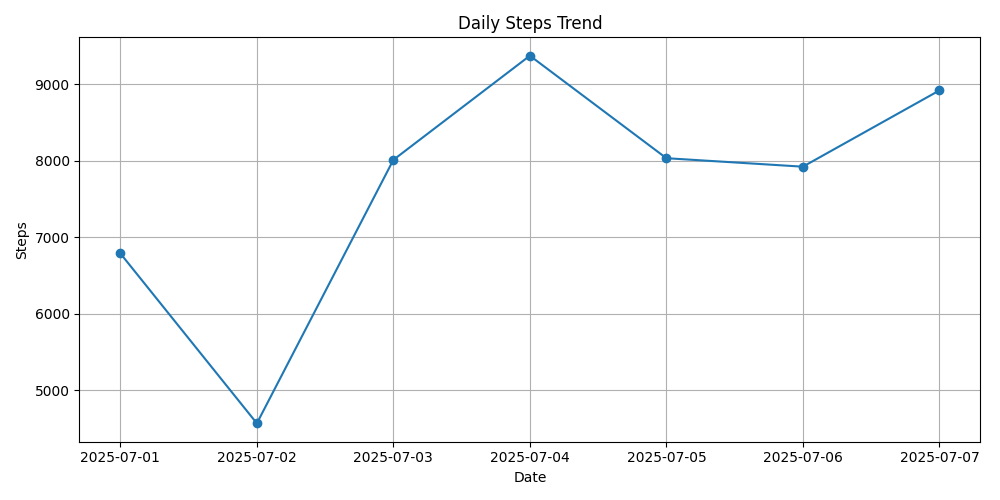

# 🩺 Health Tracker Analyzer

A Python + Excel project that analyzes daily health data like steps, heart rate, sleep hours, and calories.  
It generates a summarized health report and a line chart of steps trends.

## 📁 Features

- 📊 Reads health data from Excel
- 📈 Calculates averages (steps, sleep, heart rate)
- 📉 Shows min/max heart rate
- 📤 Exports a summary Excel report
- 🖼 Generates a steps chart (`steps_chart.png`)

## 🛠 Tools Used

- Python
- Pandas
- Matplotlib
- Excel

## 📷 Screenshots

## 💡 Future Ideas

- Add BMI calculator
- Weekly health alerts
- Turn into a Django dashboard

## 👤 Author

[Deepadharshini R](https://github.com/Deepadharshini1311)

